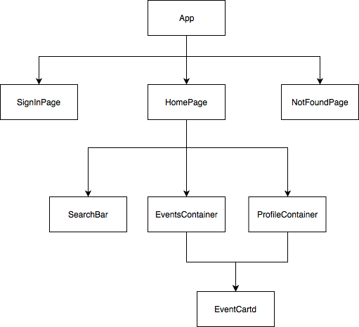

# WebFramework

## The framework (at `./src/framework`)

### Rendering
The framework I built is based on the philosophy of React, which implements the necessary mechanism of React and provides similar APIs, but some advanced techniques to improve performance used by React are left out here, like incremental reconciliation.

Rendering of the framework is done by storing a virtual DOM, and every time at render, we generate the new virtual DOM from javascript and compare it with the old DOM. The elements that changed will be be re-rendered. Virtual elements are the objects returned by `createElement()` function at [framework.js](./src/framework/framework.js), and they are what constitude the virtual DOM in the framework, representing what the real DOM elements are expected to look like. Each actual DOM element like div, p, span will have a reference to the virtual element, and the virtual element will have a reference to the component that created it. The component will keep a reference to the real DOM element for state change and re-render.

Same as React, we construct the UI from components, and they are defined in [framework.js](./src/framework/framework.js). Two types of components are defined here: Component and PureComponent. PureComponent is the stateless component, which means that it doesn't keep state, while Component has state to keep track of and trigger its own re-render.

The rendering logic lies in [frameworkDOM.js](./src/framework/framework.js), and the entry point is the `render` function, it simply takes a virtual element, a container node of the element, and `diff` it against the old DOM element that we either replace or update. By default it is set to be the first child of the container. 

The `diff` function first checks whether the virtual element is a component, `diffComponent()` will be invoked if it is. `diffComponent` takes a new virtual element, an old component, a container node and the DOM element. If they have the same constructors, which means that they are the same type of component, we can update it copying the old props over and then call `render()` function to get the new virtual element. However, if the component is nested, which means that it has child components, we will call `diffComponent()` recursively, otherwise normal `diff()` would suffice.

 If the previous element in `diff` is not a component, we will check if the new virtual element has the same type as the old one, if does it will update the corresponding DOM element using `updateTextNode()` or `updateDOMElement()` depending on type of the element, and then we will call `diffList()` to update its children according to keys. If the new one has a different type from the old one, it will be inserted into the DOM by calling function `mountElement()`.

`mountElement()` will mount either a component or a simple node including text node and DOM element depending on type of the virtual element. For simple node, `mountSimpleNode()` will remove the old DOM element and insert a new DOM element into the DOM, and all the references will also be copied to the new element. At the end, we will call `mountElement()` recursively to mount all its children. For component, `mountComponent()` will be invoked, and we will create a component from its constructor, which is stored in `virtualElement.type`. For pure component, we will set its render function as its render function is not explicitly specified, while for component, we will set a callback function `handleComponentStateChange()` to handle its state change. The function `handleComponentStateChange()` is just to update the state of the component given its new state, rerender it and then start the diff process.

While creating the new DOM element in `mountSimpleNode()`, we need to update all events listeners and attributes of the newly created element, and that's what we do in the `updateDomElement() function`.

For `diffList()` function, it takes a list of virtual elements and its parent DOM node, iterates through the DOM elements we want to diff against and divide them into keyed and unkeyed elements. After the separation, we will iterate through the virtual elements. For keyed elements, if there is a DOM element with the same key, we will move it to the correct position(index of the virtual element) and do the diff as per usual. Otherwise if there is no DOM element with the same key, we will create a new DOM element. For virtual elements without a key, we will diff them against DOM elements at the same index as the unkeyed DOM elements array. If there is no DOM element with the same index, a new DOM element will be created.

### State Management

The framework is similar to Redux, and the source file is at `./src/framework/redux.js`, as these two functions are pretty similiar to redux, detailed explanation will be left out.

Basically there are two functions, `createStore()` and `connect()`.
* createStore(): creates a store from the reducer. It has three function attributes, `getState()` returns the current state; `dispatch()` receives an actions and call reducer to execute corresponding state change, each time `dispatch()` is called, all the subscribed handlers will be invoked; `subscribe()` subscribes a handler;

* connect(): servers as a wrapper for component. Each component passed in will be passed with props from state in store, specified by `mapStateToProps` and `mapDispatchToProps`.

### Routing

For routing, source file `Route.js` at `./src/framework`; `Route` render some UI when current URL matches a location specified in the Route’s path prop. L

The `Route` component is similar to React Router, hence only some differences will be explained here. Props for `Route` include `exact, path, enabled, render`. `exact` and `path` are same as props for Route in React Router, `enabled` indicates whether the route should be enabled or not. I add this for the purpose of authentication. `render` is a callback that will be executed and returned upon match. This `Route` also support parameter in path, with the usage of library `path-to-regexp`. The logic of `Route` is that first it will check for path match, if there is a match it will return whatever should be rendered as specified by the `render` props, but if not it will just return an empty div. However, to make the `Route` fully functional, it needs to be aware of current URL changes, like when user clicks on forward/back button. Hence, in the `componentWillMount/componentWillUnmount` function, event listener is added for state `popstate`, which will be fired whenever user clicks on forward/back button.

## The Web App (at `./src/app`)

The app can be destructed as following: 

* API for the website is at `./src/app/api.js`, and the api is a local one mocked by json-server, and the data source is at './server/db.json', where users are uniquely identified by id, as well as events. The authentication token is generated and verified with library `jsonwebtoken`. Acess token is stored in sessionStorage for persistency.

* Some constants are defined at `./src/app/Constants.js`, like search tag filter and time filters.

* Routes for the app are:
   * /: Sign in page if user not logged in, home page otherwise
   * /events/id: Detail of event with a specific id
   * /profile/id: Profile page of a user with a specific id
   * All other pages will fall into a 404 page that can be redirected back to home with one click
